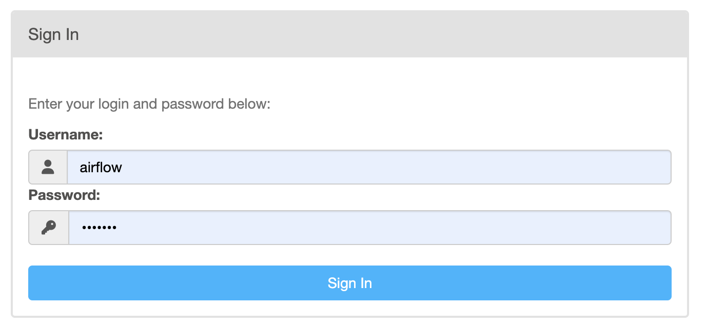
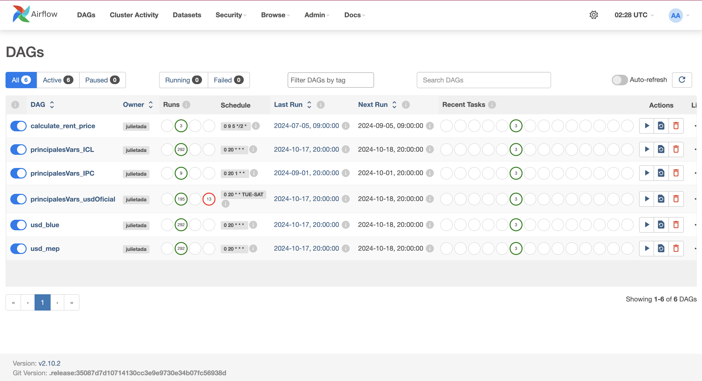
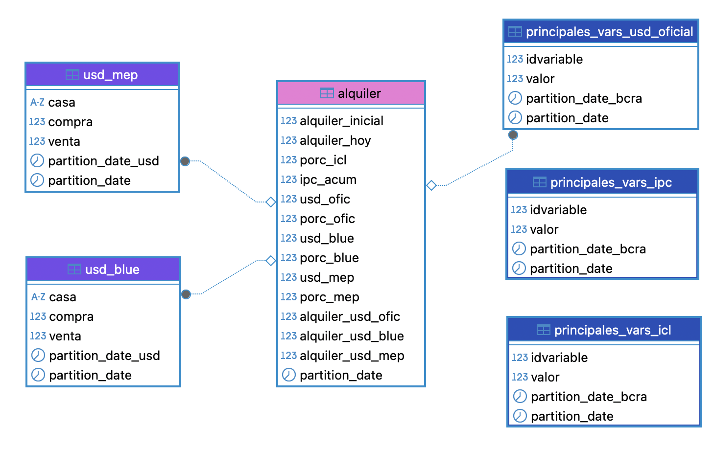

# Rent price calculator
Una herramienta para calcular precios de alquiler basados en variables económicas. Integra datos en tiempo real para ajustes dinámicos de alquiler.


## Abstract
Como es de público conocimiento, conseguir alquiler en Argentina no es tarea fácil. En 2024, tras la sanción de la última ley de alquileres, las condiciones de los contratos se definen entre las partes. Por lo tanto, puede que te aumenten el alquiler una vez por año, cinco veces, o que tu contrato sea en moneda extranjera. Recordar estas características suele ser algo a lo que nos acostumbramos, pero, ¿qué tal si, para lograr una mejor planificación, automatizamos una tabla que nos indique cuánto subirá nuestro alquiler este mes? Además, podemos compararlo contra el valor del dólar, la inflación, etc.


## Estructura del Proyecto

```bash
rent-price-calculator/
│
├── docker-compose.yml        # Configuración de Docker Compose
├── Dockerfile                # Instrucciones para construir la imagen de Docker 
├── README.md                 # Documentación sobre el proyecto, instalación y uso.
├── requirements.txt          # Dependencias necesarias para el proyecto.
├── .env                      # Variables de entorno con información sensible
├── .gitignore                # Archivos y carpetas que Git debe ignorar.
├── config.yml                # Configuración de la base de datos
├── .github/workflows/        # Directorio para los flujos de trabajo de GitHub Actions.
│   └── ci.yml                # Archivo de configuración para la integración continua (CI).
├── airflow_variables/        # Carpeta que contiene los archivos JSON con variables de Airflow.
│   ├──  airflow_variables_bcra.json  # Variables relacionadas con BCRA (Banco Central de la República Argentina).
│   ├──  airflow_variables_usd.json   # Variables relacionadas con el tipo de cambio paralelo.
│   └── airflow_variables_rent.json   # Variables relacionadas con el cálculo del precio de alquiler.
├── dags/                     # Carpeta para DAGs de Airflow.
│   │   ├── etl_principales_vars_bcra.py  # DAG para la extracción y carga de variables del BCRA.
│   │   ├── etl_usd_mep_blue.py          # DAG para la extracción y carga del USD MEP/BLUE.
│   │   └── etl_rent_price.py             # DAG para calcular el precio de alquiler.
├── logs/                     # Carpeta con logs generados por los DAGs de Airflow.
├── plugins/                  # Carpeta para plugins personalizados de Airflow.
├── images/                   # Carpeta para almacenar imágenes relacionadas con el proyecto (opcional).
├── tasks/                    # Carpeta para las tareas individuales que componen los DAGs.
│   ├── bcra/                 # Carpeta para las tareas relacionadas con el BCRA.
│   │   ├── extract_bcra.py   
│   │   ├── load_bcra.py      
│   │   └── transform_bcra.py 
│   ├── usd/                  # Carpeta para las tareas relacionadas con el USD.
│       ├── extract_usd.py    
│       ├── load_usd.py       
│       └── transform_usd.py 
│   └── rent/                 # Carpeta para las tareas relacionadas con el precio de alquiler.
│   │   ├── extract.py        
│   │   ├── load.py           
│   │   └── transform.py      
├── tests/                    # Carpeta para los tests unitarios
│   ├── test_extract_bcra.py  
│   ├── test_extract_usd.py   
│   └── test_libraries.py     
```

## Requisitos Previos

Asegúrate de tener instalados los siguientes programas en tu máquina:

- [Docker](https://www.docker.com/get-started)
- [Docker Compose](https://docs.docker.com/compose/install/)
- [Python](https://www.python.org/downloads/) (versión 3.10)


## Pasos para Ejecutar

1. **Clonar el Repositorio**

   Clona este repositorio en tu máquina local utilizando Git:

   ```bash
   git clone https://github.com/JulietaDA/rent-price-calculator.git
   cd rent-price-calculator
   ```


2. **Configurar Variables de Entorno**

    Configura las variables necesarias en un archivo `.env`, incluyendo tus credenciales.


3. **Construir y levantar los Contenedores**

    Ejecuta el siguiente comando para construir la imagen de Docker y levantar los contenedores:

    ```bash
    docker-compose up --build
    ```

    Esto iniciará todos los servicios definidos en `docker-compose.yml`, incluyendo Airflow.

4. **Acceder a Airflow**

    Una vez que los contenedores estén en funcionamiento, accede a la interfaz de Airflow en tu navegador:

    ```arduino
    http://localhost:8080
    ```

    Las credenciales son las predeterminadas (usuario: airflow, contraseña: airflow).

 <p align="center">

</p>

5. **Activar los DAGs**

    En la interfaz de Airflow, verás una lista de los DAGs disponibles. Primero los DAGs relacionados con las variables que economicas (`principalesVars_ICL`, `principalesVars_IPC`, `principalesVars_usdOficial`, `usd_blue`, `usd_mep`) haciendo clic en el interruptor de activación en la columna "On/Off". Luego, el de `calculate_rent_price`.

    En la práctica, se pueden dejar todos los DAGs activos. La razón para activar primero los de variables económicas es que se deben popular las tablas antes de poder calcular los inputs de la tabla de `alquiler`. En este caso se estableció el 2023-12-31 como fecha inicial para popular las tablas.

<p align="center">
    
</p>

## Bases de Datos

<p align="center">
    
</p>

***Alquiler***:
Esta tabla registra el **alquiler inicial** y, tras su cálculo, el **alquiler hoy**. Además, incluye diversas variables económicas como el **porcentaje del ICL**, que se utiliza para calcular el aumento, el **IPC acumulado** y los valores de los diferentes tipos de dólar (oficial, blue y MEP), junto con sus respectivos porcentajes y el alquiler en cada tipo de moneda. Dado que la actualización de mi contrato de locación es bimestral, la tabla se actualiza cada dos meses.

***Principales Variables - ICL***:
Esta tabla incluye las principales variables económicas relacionadas con el Índice de Contratos de Locación, donde se almacena el **idvariable**, su **valor** y las fechas de partición para el seguimiento de cambios a lo largo del tiempo. Posee información diaria.

***Principales Variables - IPC***:
Similar a la tabla de ICL, esta tabla contiene información sobre el **idvariable** y su **valor**, junto con fechas de partición para capturar la evolución del Índice de Precios al Consumidor. Posee información mensual.

***Principales Variables - USD Oficial***:
Esta tabla registra los valores del **dólar oficial** informados por el BCRA, incluyendo el **idvariable**, su **valor** y las fechas de partición, lo que permite un análisis del comportamiento del tipo de cambio oficial a lo largo del tiempo. Posee información para los días hábiles; por esta razón, el DAG corre de martes a sábados y puede presentar fallas los días feriados.

***USD Blue***:
Esta tabla proporciona información sobre el mercado del dólar blue, incluyendo los valores de **compra** y **venta**, así como las fechas de partición para facilitar el análisis temporal. Posee información diaria.

***USD MEP***:
De manera análoga a la tabla de USD Blue, esta tabla registra los valores de **compra** y **venta** para el dólar bolsa o MEP, con fechas de partición para un seguimiento adecuado. Posee información diaria.


## Pipeline

El pipeline está diseñado para automatizar el proceso de extracción, transformación y carga (ETL) de datos relacionados con el cálculo del alquiler y las variables económicas. A continuación, se describe su estructura:

1. **Extracción de Datos**
   - Se utilizan scripts específicos para extraer datos de fuentes externas y bases de datos, incluyendo información sobre el alquiler y variables económicas (ICL, IPC, USD Oficial, USD Blue, USD MEP). Para la API del BCRA y de USD, se construyó un único script para cada tipo, donde se itera sobre las diferentes variables que se quieren capturar, configurando el schedule y el sufijo de la tabla a escribir.

2. **Transformación de Datos**
   - Los datos extraídos son transformados para asegurar que estén en el formato correcto para su análisis. Esto incluye el cálculo de aumentos de alquiler, la conversión de monedas, la agregación de datos económicos y la incorporación de particiones.

3. **Carga de Datos**
   - Una vez transformados, los datos son cargados en las tablas correspondientes en la base de datos. Esto incluye la actualización del alquiler inicial, alquiler hoy y las principales variables económicas, además de poblar las tablas con información económica de acuerdo al schedule establecido.

4. **Programación y Automatización**
   - Los DAGs en Airflow se encargan de programar y gestionar el flujo de trabajo. Se configuran para que se ejecuten en momentos específicos, asegurando que los datos se actualicen de acuerdo con las necesidades del contrato de locación y las variables económicas.

Este enfoque modular permite una fácil modificación y escalabilidad del pipeline, facilitando la incorporación de nuevas fuentes de datos o cambios en las lógicas de cálculo según sea necesario.

## Módulo de Tests

Para asegurar la calidad y funcionamiento adecuado del pipeline, se ha implementado un módulo de tests. Este módulo incluye pruebas unitarias para validar algunas funciones.

1. **Estructura de Pruebas**
   - Las pruebas están organizadas en archivos separados dentro de la carpeta `tests/`. Cada archivo contiene pruebas específicas para los diferentes scripts y funciones del pipeline. Por ejemplo:
     - `test_extract_bcra.py`: Contiene pruebas para validar la correcta extracción de datos de la API del BCRA.
     - `test_extract_usd.py`: Incluye pruebas para la extracción de datos de los tipos de cambio del USD.
     - `test_libraries.py`: Abarca pruebas generales para las bibliotecas y funciones utilizadas en el proyecto.

2. **Ejecución de Tests**
   - Para ejecutar las pruebas, asegúrate de estar en el directorio raíz del proyecto y utiliza el siguiente comando:
     ```bash
     pytest tests/
     ```
   - Este comando ejecutará todas las pruebas definidas en la carpeta `tests/` y generará un informe sobre el estado de cada prueba.

3. **Integración Continua**
   - El módulo de tests está integrado en el flujo de trabajo de GitHub Actions, asegurando que las pruebas se ejecuten automáticamente con Pull Request, manteniendo así la calidad del código y facilitando la detección temprana de errores.


## Trabajo Futuro

Aunque el proyecto ya cumple con su objetivo principal, hay varias mejoras que me gustaría considerar para enriquecer la funcionalidad y la usabilidad del sistema:

1. **Notificación por Correo Electrónico**
   - Implementar un sistema que envíe automáticamente un correo electrónico al usuario al final de cada ciclo de cálculo, informando sobre el aumento de alquiler y cualquier otra variable relevante.

2. **Visualización de Datos**
   - Incluir gráficos que muestren la evolución de las diferentes variables económicas a lo largo del tiempo. Esto permitiría a los usuarios visualizar tendencias y comparaciones de manera más intuitiva.

3. **Mayor Cobertura de Tests Unitarios**
   - Expandir el módulo de tests para incluir pruebas más exhaustivas y cubrir todos los posibles casos de uso. Esto ayudaría a garantizar una mayor estabilidad y confiabilidad del código.

4. **Interfaz de Usuario (UI)**
   - Desarrollar una interfaz de usuario sencilla que permita a los usuarios interactuar con el sistema de manera más amigable. Esto podría incluir formularios para ingresar datos, visualizar resultados y recibir notificaciones.

5. **Análisis Predictivo**
   - Implementar modelos de análisis predictivo que utilicen las variables económicas históricas para prever futuros aumentos de alquiler, proporcionando así información más proactiva a los usuarios.

## :)